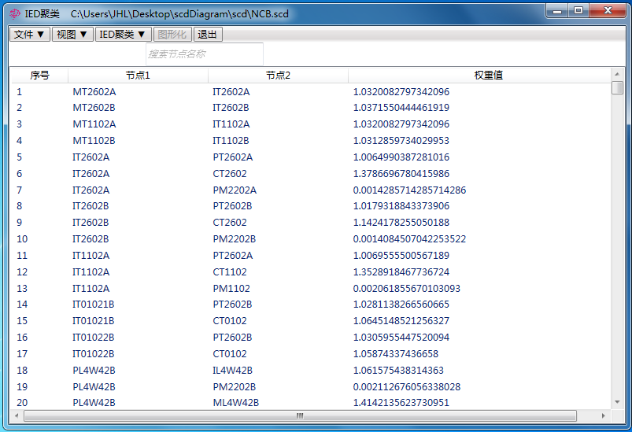
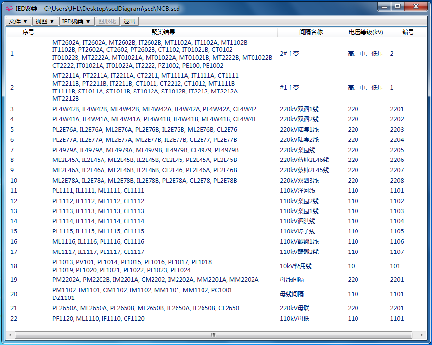
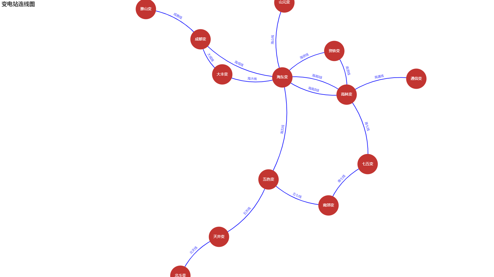

*If interested in this or having problem, just contact me, e-mail: 570503271@qq.com*
## A software based on IEC 61850 protocal and Substation Configuration Description file.
**Software running snapshot.These images are automatically generated by the software,no need of manual processing.**

### 750kV Substation

### 500kV Substation

### 220kV Substation

## IEDs clusters detection by an algorithm

### IEDs info:

### Edges of IEDs:

### Detected communities in SCD file:

### Substations connection diagram:

### IED devices topologic graph:

