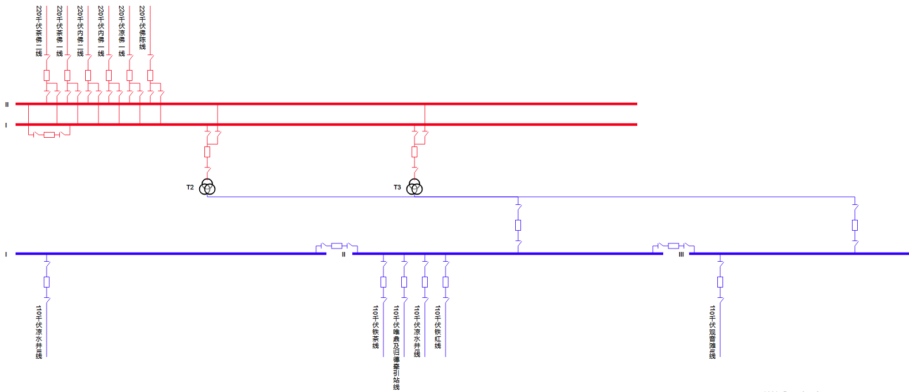

# 通过SCD文件画出一次接线的结构
**解析智能变电站SCD文件，通过分析文件中配置的IED信息，进行数据处理，提取一次设备的关联关系，获取一次设备的连接关系，并最终画出主接线图。本程序对智能站工程文件在线匹配校验，实现实时监视运行设备与管控系统工程文件一致性具有很强实用价值。**
> 本项目为一个原型展示系统，旨在证明解析的可行性，程序当中还存在一些不足，后期会进行维护和修复，并完善更多功能。

一个解析的结果，符合国家电网智能变电站“六统一”规范的SCD配置文件，均能实现正确解析得到结果，下图所示接线结构和变电站实际的CAD图上的连线方式一致，证明该解析的正确性，后期会继续完善本项目提供能多功能。（由于极少数较老的SCD文件，存在描述，命名的严重不规范，对其进行解析存在一定困难）。

