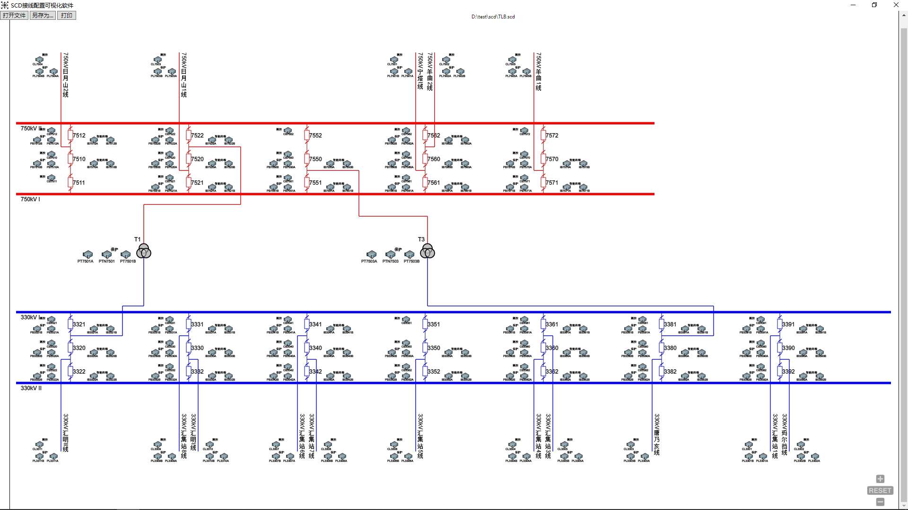
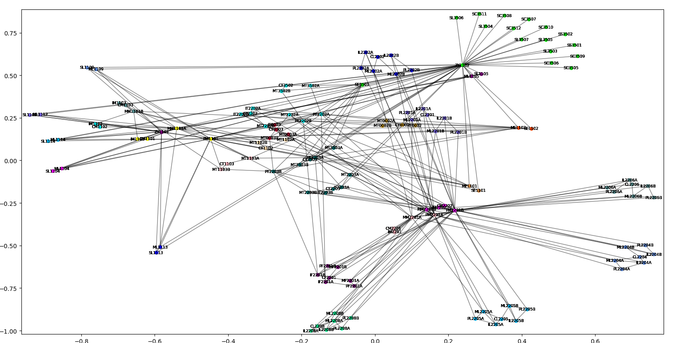

## A software based on IEC 61850 protocal and Substation Configuration Description file.
**Software running snapshot.These images are automatically generated by the software,no need of manual processing.**

750kV Substation

500kV Substation

## IEDs clusters detection by an algorithm

(*clusters detection, 21 communities in all*)
### 1 ['IM2201', 'CM2201', 'MM2201A', 'MM2201B', 'IM2202', 'PM2201A', 'CM2202', 'PM2201B']
### 2 ['IF2201A', 'MF2201A', 'IF2201B', 'MF2201B', 'PF2201A', 'CF2201', 'PF2201B']
### 3 ['ML2201A', 'ML2201B', 'IL2201A', 'PL2201A', 'CL2201', 'IL2201B', 'PL2201B']
### 4 ['ML2202A', 'ML2202B', 'IL2202A', 'PL2202A', 'CL2202', 'IL2202B', 'PL2202B']
### 5 ['ML2204A', 'ML2204B', 'IL2204A', 'PL2204A', 'CL2204', 'IL2204B', 'PL2204B']
### 6 ['ML2205A', 'ML2205B', 'IL2205A', 'PL2205A', 'CL2205', 'IL2205B', 'PL2205B']
### 7 ['ML2206A', 'ML2206B', 'IL2206A', 'PL2206A', 'CL2206', 'IL2206B', 'PL2206B']
### 8 ['MT2202A', 'MT2202B', 'PT2202A', 'IT2202A', 'CT2202', 'MT1102A', 'MT3502A', 'IT2202B', 'PT2202B', 'MT1102B', 'MT3502B', 'CT1102', 'CT3502']
### 9 ['MT2203A', 'MT2203B', 'PT2203A', 'IT2203A', 'CT2203', 'MT0003A', 'MT1103A', 'MT3503A', 'CT0003', 'IT2203B', 'PT2203B', 'MT0003B', 'MT1103B', 'MT3503B', 'CT1103', 'CT3503', 'IT0003']
### 10 ['ML2208A', 'ML2208B', 'IL2208A', 'PL2208A', 'CL2208', 'IL2208B', 'PL2208B']
### 11 ['ZY1102', 'SE3501', 'SL3503', 'SL3504', 'SC3505', 'SC3506', 'SC3507', 'SC3508', 'SS3501', 'SL3505', 'SL3506', 'SL3507', 'SC3509', 'SC3510', 'SC3511', 'SC3512', 'SS3502']
### 12 ['PM1101', 'MM1101A', 'MM1101B', 'IM1101', 'IM1102', 'IM1103', 'CM1101', 'CM1102', 'CM1103']
### 13 ['MT0002A', 'MT0002B', 'CT0002', 'IT0002']
### 14 ['ME1101', 'SE1101']
### 15 ['ME1102', 'SE1102']
### 16 ['ML1104', 'SL1104']
### 17 ['ML1105', 'SL1105', 'ZY1101']
### 18 ['ML1112', 'SL1112']
### 19 ['ML1113', 'SL1113']
### 20 ['ML1109', 'SL1109']
### 21 ['ML1114', 'SL1114']

IED devices topologic graph

